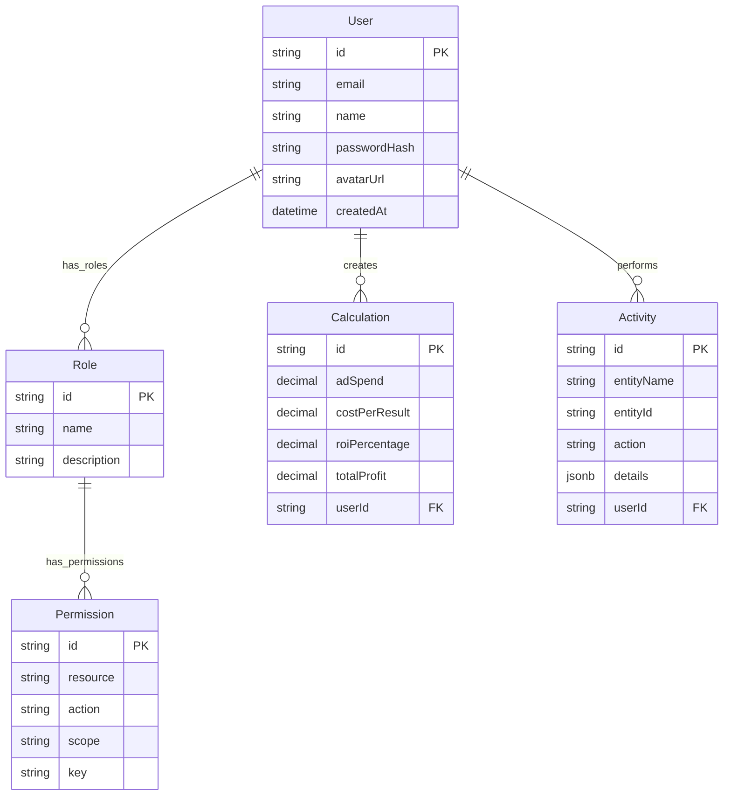

# API Reference

Aplikasi ini menggunakan standard REST patterns, yang diabstraksi menggunakan **CRUD Factory** dan **API Wrapper** untuk konsistensi dan security.

## CRUD Factory (`src/server/lib/crud-factory.ts`)
Sebagian besar Resource-based routes dibuat menggunakan `createCollectionHandlers` dan `createItemHandlers`. Ini memastikan konsistensi dalam hal:
-   **Authentication**: Semua route diproteksi via `withAuth`.
-   **RBAC**: Permissions dicek secara otomatis (e.g., `users:read`, `users:create`).
-   **Scoping**: Data access dibatasi berdasarkan permission scope (`own` vs `any`).

### Standard Endpoints
Untuk Resources seperti **Users**, **Roles**, dan **Permissions**, endpoint berikut biasanya tersedia:

| Method | Endpoint | Description | Required Permission |
| :--- | :--- | :--- | :--- |
| `GET` | `/api/[resource]` | List items (filtered by scope) | `[resource]:read` |
| `POST` | `/api/[resource]` | Create new item | `[resource]:create` |
| `GET` | `/api/[resource]/[id]` | Get single item | `[resource]:read` |
| `PUT` | `/api/[resource]/[id]` | Update item | `[resource]:update` |
| `DELETE` | `/api/[resource]/[id]` | Delete item | `[resource]:delete` |

## Data Model (ERD)

Diagram berikut menggambarkan entitas database dan hubungannya, yang mendasari struktur payload API.

## Key Routes

### 1. Dashboard (`src/app/api/dashboard`)
-   `GET /api/dashboard/summary`
    -   **Permission**: `dashboard:read`
    -   **Returns**: Aggregated data untuk dashboard (KPIs, Activity Feed, ROI Status).
    -   **Logic**:
        -   Fetch count `Users`.
        -   Calculate critical ROI dari `Calculations`.
        -   Return recent activity (Registrations + Calculations).

### 2. Auth (`src/app/api/auth`)
-   `/api/auth/[...nextauth]`
    -   Dihandle oleh **NextAuth.js**.
    -   Support Credentials Provider (Email/Password).
    -   Session callbacks melakukan hydrate User Roles dan Permissions dari DB.

### 3. AI (`src/app/api/ai`)
-   `POST /api/ai/analyze`
    -   **Body**: `{ adSpend, cpr, aov, roi, profit }`
    -   **Returns**: JSON analysis dari campaign performance menggunakan LLM.

### 4. Calculations (`src/app/api/calculations`)
-   `POST /api/calculations`
    -   Menyimpan hasil perhitungan baru.
    -   **Permission**: `calculations:create` (likely).
-   `GET /api/calculations`
    -   Mengambil history.
