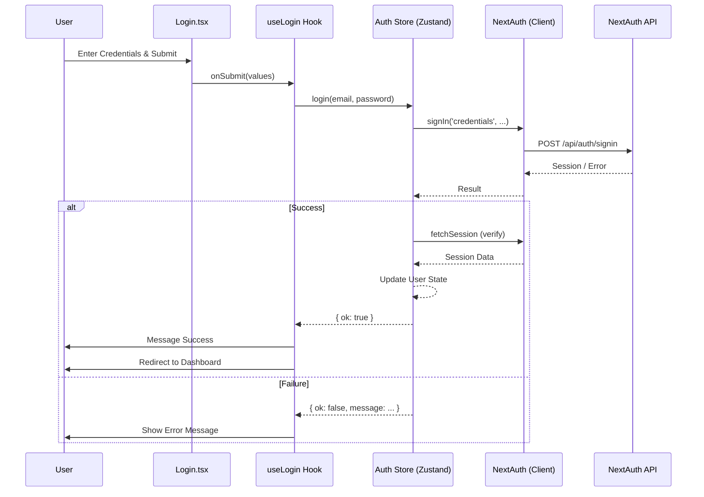

# Auth Module Documentation

## Overview
The Auth module handles user authentication, including login, registration, and session management. It uses `next-auth` for backend authentication and `zustand` for client-side state management.

## Key Components

### Views
-   **Login.tsx**: The main login page (`/auth/login`). Renders the login form and handles user interaction.
-   **Register.tsx**: The registration page (`/auth/register`).

### Hooks
-   **useLogin.ts**: Encapsulates the logic for the login view. It handles form submission, calls the auth store, and redirects the user after successful login.
-   **useRegister.ts**: Encapsulates logic for registration.

### Store
-   **auth.ts**: A Zustand store that manages the user's session state (`user`, `loading`).
    -   `login(email, password)`: Calls `next-auth`'s `signIn`.
    -   `logout()`: Calls `next-auth`'s `signOut`.
    -   `bootstrap()`: Hydrates the store from the server-side session.

## Authentication Flow

The login process follows these steps:
1.  User enters credentials in `Login.tsx`.
2.  Form submission triggers `onSubmit` in `useLogin.ts`.
3.  `useLogin` calls `authStore.login`.
4.  `authStore.login` invokes `signIn("credentials")` from `next-auth/react`.
5.  If successful, the store updates the user state and `useLogin` redirects to the dashboard.

## Mermaid Flowchart

