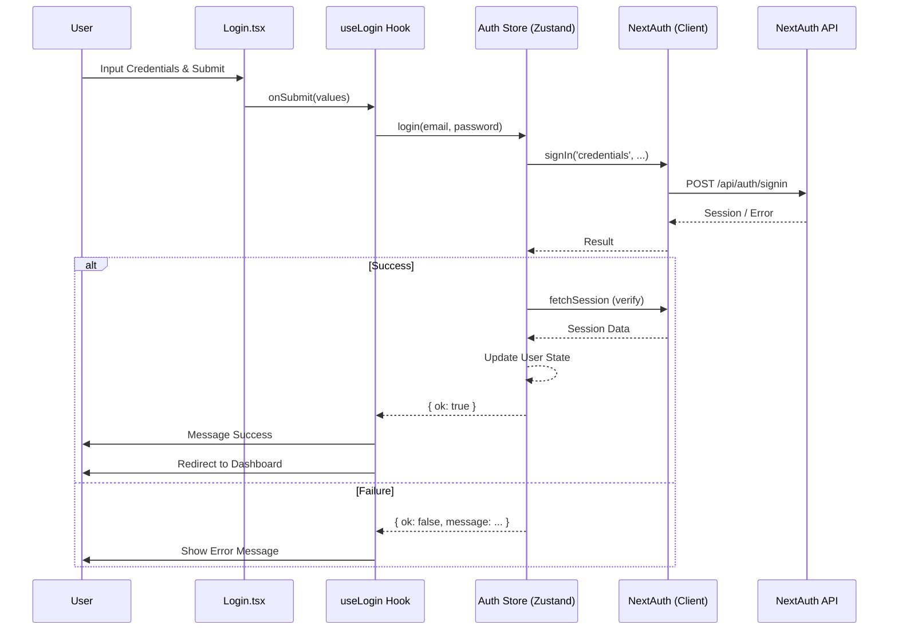

# Auth Module Documentation

## Overview
Modul Auth menangani otentikasi User, termasuk login, register, dan manajemen Session. Modul ini menggunakan `next-auth` untuk otentikasi backend dan `zustand` untuk manajemen State di sisi Client.

## Key Components

### Views
-   **Login.tsx**: Halaman login utama (`/auth/login`). Merender form login dan menangani interaksi User.
-   **Register.tsx**: Halaman registrasi (`/auth/register`).

### Hooks
-   **useLogin.ts**: Encapsulate logic untuk View login. Menangani submit form, memanggil Auth Store, dan melakukan redirect User setelah login berhasil.
-   **useRegister.ts**: Encapsulate logic untuk registrasi.

### Store
-   **auth.ts**: Zustand Store yang mengelola State session User (`user`, `loading`).
    -   `login(email, password)`: Memanggil `signIn` dari `next-auth`.
    -   `logout()`: Memanggil `signOut` dari `next-auth`.
    -   `bootstrap()`: Melakukan Hydrate store dari session server-side.

## Authentication Flow

Proses login mengikuti langkah-langkah berikut:
1.  User memasukkan credentials di `Login.tsx`.
2.  Submit form memicu `onSubmit` di `useLogin.ts`.
3.  `useLogin` memanggil `authStore.login`.
4.  `authStore.login` memanggil `signIn("credentials")` dari `next-auth/react`.
5.  Jika berhasil, Store memperbarui State User dan `useLogin` melakukan redirect ke dashboard.

## Mermaid Flowchart

