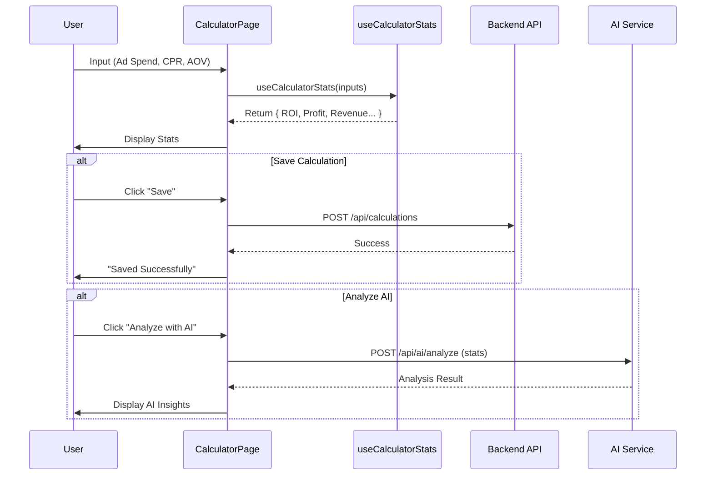

# Calculate Module Documentation

## Overview
Modul Calculate memungkinkan User untuk mensimulasikan dan melacak performance campaign iklan. Modul ini mencakup kalkulator untuk memproyeksikan ROI, Profit, dan metrik lainnya berdasarkan Ad Spend, CPR, dan AOV. Modul ini juga terintegrasi dengan AI untuk analisis dan menyimpan history perhitungan.

## Key Components

### Views
-   **CalculatorPage.tsx**: Interface utama.
    -   Input: Ad Spend, Cost Per Result (CPR), Average Order Value (AOV), Product Price.
    -   Output: ROI, Profit, Revenue, dll.
    -   Actions: Calculate AI Analysis, Save Calculation.
-   **TableCaclulator.tsx**: Menampilkan history perhitungan yang disimpan dalam format Table.

### Hooks
-   **useCalculatorStats.ts**: Berisi business logic inti untuk kalkulator.
    -   `results = adSpend / cpr`
    -   `revenue = results * aov`
    -   `profit = revenue - adSpend`
    -   `roi = (profit / adSpend) * 100`

## Calculation Flow

## Logic Details: Rumus Perhitungan
Hook `useCalculatorStats` bertanggung jawab untuk memberikan umpan balik instan di UI. Berikut adalah penjelasan rinci dari setiap rumus yang digunakan:

### 1. Results (Estimasi Hasil)
Jumlah hasil (konversi/penjualan) yang didapat dari biaya iklan.
-   **Rumus**: `Results = Ad Spend / CPR`
-   **Logika**: Membagi total anggaran iklan (`Ad Spend`) dengan biaya per hasil (`CPR`). Jika CPR bernilai 0, maka Results adalah 0. Hasil dibulatkan ke bawah (`Math.floor`) untuk mendapatkan angka bulat.

### 2. Revenue (Pendapatan Kotor)
Total pendapatan yang dihasilkan dari kampanye.
-   **Rumus**: `Revenue = Results * AOV`
-   **Logika**: Mengalikan jumlah `Results` yang didapat dengan rata-rata nilai pesanan (`AOV`).

### 3. Profit (Keuntungan Bersih)
Keuntungan bersih setelah dikurangi biaya iklan (namun belum termasuk COGS produk di rumus ini, asumsi margin produk sudah diperhitungkan dalam AOV atau dipisah).
-   **Rumus**: `Profit = Revenue - Ad Spend`
-   **Logika**: Mengurangi total pendapatan (`Revenue`) dengan biaya yang dikeluarkan untuk iklan (`Ad Spend`).

### 4. ROI (Return on Investment)
Persentase pengembalian investasi iklan.
-   **Rumus**: `ROI = (Profit / Ad Spend) * 100`
-   **Logika**: Mengukur efisiensi kampanye. Menghitung rasio keuntungan (`Profit`) terhadap biaya (`Ad Spend`) dalam bentuk persen.

### 5. Margin Per Result
Selisih antara nilai pesanan dan biaya untuk mendapatkan satu pesanan tersebut.
-   **Rumus**: `Margin = AOV - CPR`
-   **Logika**: Menunjukkan berapa banyak sisa uang dari setiap penjualan setelah dikurangi biaya iklan per penjualan tersebut.

### 6. CPR Target
Target biaya per hasil yang disarankan untuk menjaga profitabilitas (Rule of Thumb: 30% dari harga produk).
-   **Rumus**: `CPR Target = Product Price * 0.3`
