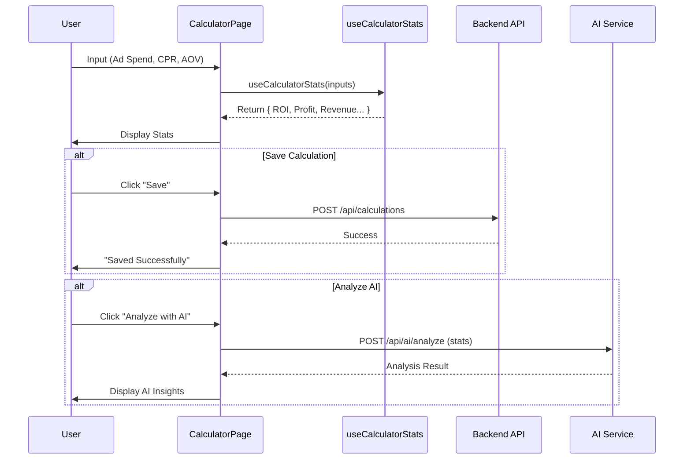

# Calculate Module Documentation

## Overview
Modul Calculate memungkinkan User untuk mensimulasikan dan melacak performance campaign iklan. Modul ini mencakup kalkulator untuk memproyeksikan ROI, Profit, dan metrik lainnya berdasarkan Ad Spend, CPR, dan AOV. Modul ini juga terintegrasi dengan AI untuk analisis dan menyimpan history perhitungan.

## Key Components

### Views
-   **CalculatorPage.tsx**: Interface utama.
    -   Input: Ad Spend, Cost Per Result (CPR), Average Order Value (AOV), Product Price.
    -   Output: ROI, Profit, Revenue, dll.
    -   Actions: Calculate AI Analysis, Save Calculation.
-   **TableCaclulator.tsx**: Menampilkan history perhitungan yang disimpan dalam format Table.

### Hooks
-   **useCalculatorStats.ts**: Berisi business logic inti untuk kalkulator.
    -   `results = adSpend / cpr`
    -   `revenue = results * aov`
    -   `profit = revenue - adSpend`
    -   `roi = (profit / adSpend) * 100`

## Calculation Flow

## Logic Details
Hook `useCalculatorStats` bertanggung jawab untuk instant feedback di UI.
-   **Results**: `Math.floor(adSpend / cpr)` (jika CPR > 0)
-   **Revenue**: `results * aov`
-   **Profit**: `revenue - adSpend`
-   **ROI**: `(profit / adSpend) * 100`
-   **Margin Per Result**: `aov - cpr`
