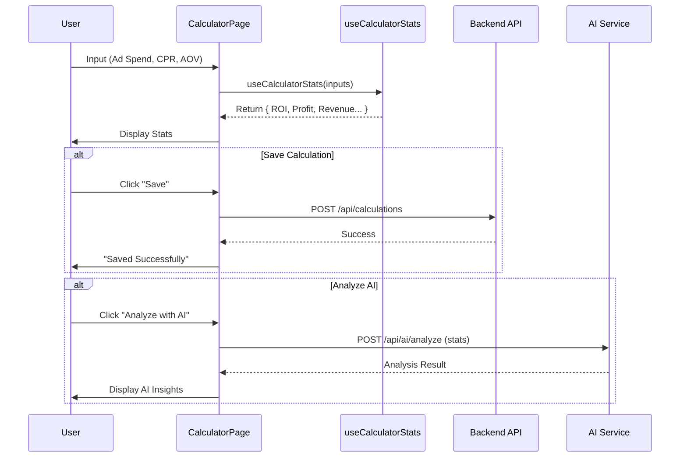

# Calculate Module Documentation

## Overview
The Calculate module allows users to simulate and track ad campaign performance. It includes a calculator for projecting ROI, profit, and other metrics based on ad spend, CPR, and AOV. It also integrates with AI for analysis and saves calculation history.

## Key Components

### Views
-   **CalculatorPage.tsx**: The main interface.
    -   Inputs: Ad Spend, Cost Per Result (CPR), Average Order Value (AOV), Product Price.
    -   Outputs: ROI, Profit, Revenue, etc.
    -   Actions: Calculate AI Analysis, Save Calculation.
-   **TableCaclulator.tsx**: Displays the history of saved calculations in a table format.

### Hooks
-   **useCalculatorStats.ts**: Contains the core business logic for the calculator.
    -   `results = adSpend / cpr`
    -   `revenue = results * aov`
    -   `profit = revenue - adSpend`
    -   `roi = (profit / adSpend) * 100`

## Calculation Flow

## detailed Logic
The `useCalculatorStats` hook is responsible for the instant feedback on the UI.
-   **Results**: `Math.floor(adSpend / cpr)` (if CPR > 0)
-   **Revenue**: `results * aov`
-   **Profit**: `revenue - adSpend`
-   **ROI**: `(profit / adSpend) * 100`
-   **Margin Per Result**: `aov - cpr`
