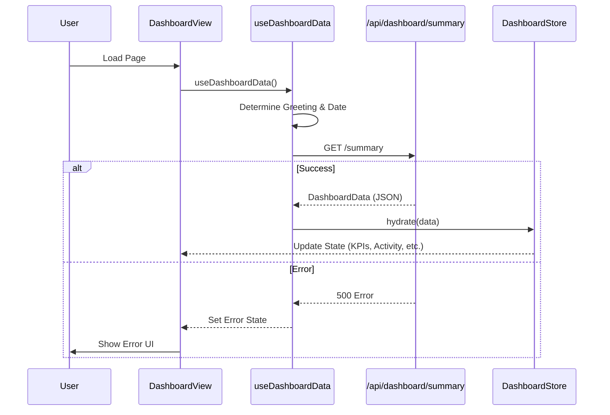

# Dashboard Module Documentation

## Overview
The Dashboard module is the central hub for the user, displaying key performance indicators (KPIs), ROI status, recent activities, and top-performing users. It fetches data separately and manages state via a dedicated Zustand store.

## Key Components

### Views
-   **DashboardView.tsx**: The main dashboard layout.
    -   Displays `KpiCard`s.
    -   Displays ROI Status with a circular progress bar.
    -   lists Top Users and Recent Activities.
    -   Provides quick actions (New Calculation, Add User).

### State Management
-   **dashboardStore.ts**: A Zustand store that holds the dashboard data.
    -   `kpis`: Array of metrics.
    -   `activities`: Recent user actions.
    -   `roiStatus`: Score and alert message.
    -   `hydrate(data)`: Updates the store with fetched data.

### Hooks
-   **useDashboardData.ts**: Manages data fetching and side effects.
    -   `fetchData()`: calls `GET /api/dashboard/summary`.
    -   On success, calls `store.hydrate(data)`.
    -   Computes dynamic greeting based on time of day.

## Data Flow

