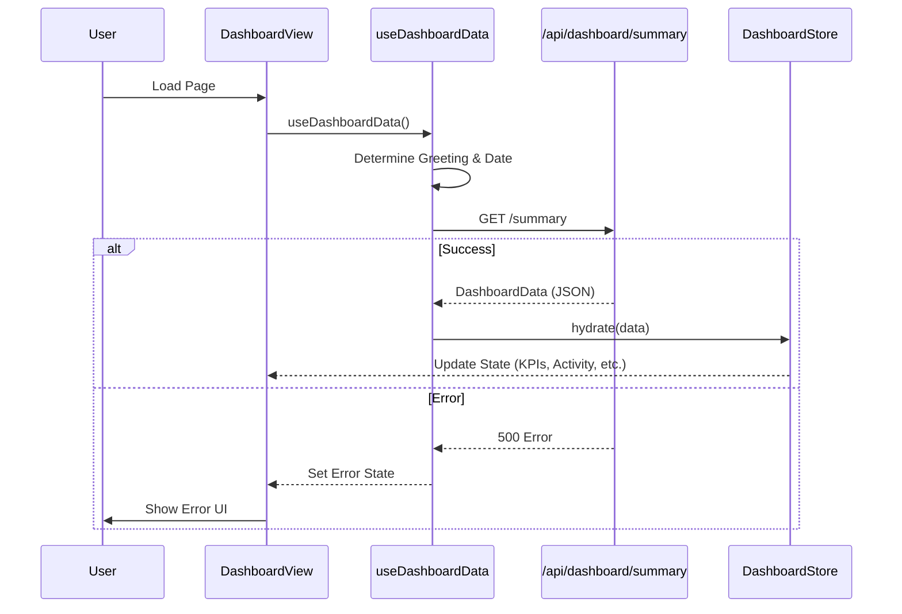

# Dashboard Module Documentation

## Overview
Modul Dashboard adalah control center bagi User, menampilkan Key Performance Indicators (KPIs), ROI Status, Recent Activities, dan Top Performing Users. Modul ini melakukan fetching data secara terpisah dan mengelola State melalui Zustand Store khusus.

## Key Components

### Views
-   **DashboardView.tsx**: Layout dashboard utama.
    -   Menampilkan `KpiCard`s.
    -   Menampilkan ROI Status dengan circular progress bar.
    -   List Top Users dan Recent Activities.
    -   Menyediakan Quick Actions (New Calculation, Add User).

### State Management
-   **dashboardStore.ts**: Zustand Store yang menyimpan data dashboard.
    -   `kpis`: Array metrics.
    -   `activities`: User actions terkini.
    -   `roiStatus`: Score dan alert message.
    -   `hydrate(data)`: Mengupdate Store dengan data yang di-fetch.

### Hooks
-   **useDashboardData.ts**: Mengelola data fetching dan side effects.
    -   `fetchData()`: memanggil `GET /api/dashboard/summary`.
    -   On success, memanggil `store.hydrate(data)`.
    -   Compute dynamic greeting berdasarkan waktu.

## Data Flow

