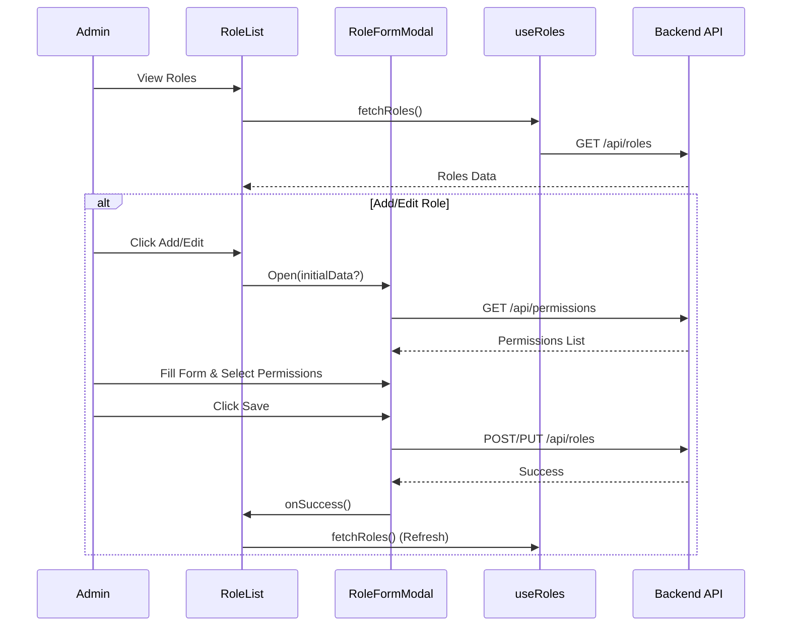

# Roles Module Documentation

## Overview
Modul Roles memungkinkan Admin untuk mengelola User Roles dan Permissions terkait. Modul ini menyediakan UI untuk list, create, edit, dan delete Roles.

## Key Components

### Components
-   **RoleList.tsx**: Component utama yang menampilkan Table Roles.
    -   Features: Search, Delete Role, Refresh.
    -   Columns: Name, Description, Permission Count.
-   **RoleFormModal.tsx**: Modal form untuk create atau update Role.
    -   Inputs: Role Name, Description.
    -   Permissions: Fetch semua permission yang tersedia dari `/api/permissions` dan menampilkannya di-group berdasarkan Resource. Memungkinkan Bulk Selection.

### Hooks
-   **useRoles.ts**: Fetch list roles dari `/api/roles`.

## Data Flow

### Viewing Roles
1.  `RoleList` menjalankan `useRoles()`.
2.  `useRoles` memanggil `GET /api/roles`.
3.  Data ditampilkan di Table.

### Creating/Editing a Role
1.  User klik "Add Role" atau "Edit".
2.  `RoleFormModal` terbuka.
3.  `RoleFormModal` fetch permissions dari `/api/permissions` (sekali).
4.  User mengisi detail dan memilih permissions.
5.  On Submit:
    -   **Create**: `POST /api/roles` dengan `{ name, description, permissionIds }`.
    -   **Update**: `PUT /api/roles/:id` dengan payload.
6.  On Success, `RoleList` melakukan refresh data.

## Mermaid Flowchart

