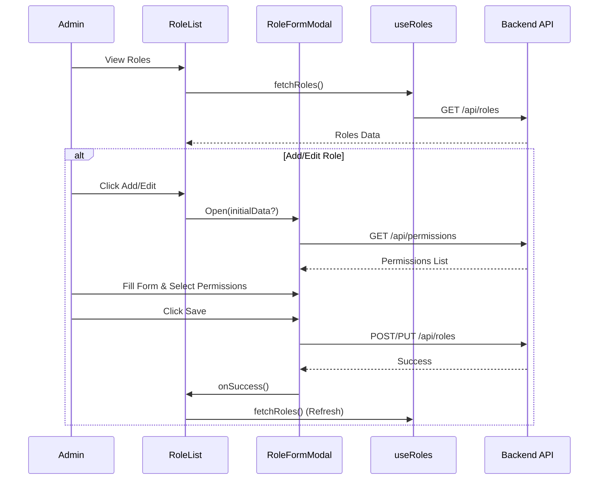

# Roles Module Documentation

## Overview
The Roles module allows administrators to manage user roles and their associated permissions. It provides a UI to list, create, edit, and delete roles.

## Key Components

### Components
-   **RoleList.tsx**: The main component displaying the table of roles.
    -   Features: Search, Delete Role, Refresh.
    -   Columns: Name, Description, Permission Count.
-   **RoleFormModal.tsx**: A modal form to create or update a role.
    -   Inputs: Role Name, Description.
    -   Permissions: Fetches all available permissions from `/api/permissions` and displays them grouped by resource. Allows bulk selection.

### Hooks
-   **useRoles.ts**: Fetches the list of roles from `/api/roles`.

## Data Flow

### Viewing Roles
1.  `RoleList` performs `useRoles()`.
2.  `useRoles` calls `GET /api/roles`.
3.  Data is displayed in the Table.

### Creating/Editing a Role
1.  User clicks "Add Role" or "Edit".
2.  `RoleFormModal` opens.
3.  `RoleFormModal` fetches permissions from `/api/permissions` (once).
4.  User fills details and selects permissions.
5.  On Submit:
    -   **Create**: `POST /api/roles` with `{ name, description, permissionIds }`.
    -   **Update**: `PUT /api/roles/:id` with payload.
6.  On success, `RoleList` refreshes the data.

## Mermaid Flowchart

