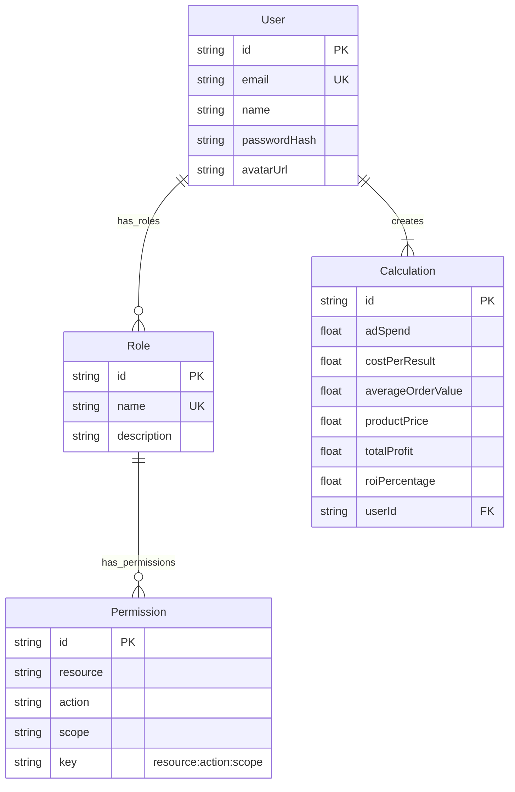

# Server Architecture

## Database (TypeORM)
The project uses **TypeORM** with a relational schema. The `AppDataSource` is initialized in `src/server/db/datasource.ts`.

### Entity Relationship Diagram (ERD)

## RBAC (Role-Based Access Control)
Access control is implemented via the `Permission` and `Role` entities.

### Logic
1.  **Permissions**: Defined by `resource` (e.g., 'user'), `action` (e.g., 'read'), and `scope` (e.g., 'any', 'own').
2.  **Assignment**: Permissions are assigned to Roles. Roles are assigned to Users.
3.  **Session Hydration**: On login (`auth.service.ts`), the system fetches all roles for the user and collects all unique permission keys. These keys are stored in the user session.
4.  **Verification**: The `can(keys, resource, action, scope)` function checks if the user's session keys include the required permission.

## Services
Business logic is encapsulated in services found in `src/server/services`.
-   **Auth Service** (`auth.service.ts`): Handles user verification against the database.
-   **Permission Service**: (Likely) manages creation/retrieval of permissions.
