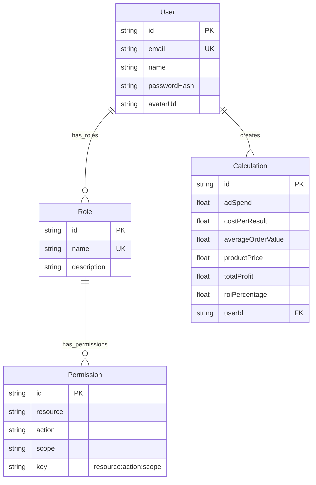

# Server Architecture

## Database (TypeORM)
Project ini menggunakan **TypeORM** dengan relational schema. `AppDataSource` diinisialisasi di `src/server/db/datasource.ts`.

### Entity Relationship Diagram (ERD)

## RBAC (Role-Based Access Control)
Access control diimplementasikan melalui Entity `Permission` dan `Role`.

### Logic
1.  **Permissions**: Didefinisikan berdasarkan `resource` (misalnya, 'user'), `action` (misalnya, 'read'), dan `scope` (misalnya, 'any', 'own').
2.  **Assignment**: Permissions di-assign ke Roles. Roles di-assign ke Users.
3.  **Session Hydration**: Saat login (`auth.service.ts`), sistem mengambil semua Roles untuk User tersebut dan mengumpulkan semua Permission Keys unik. Keys ini disimpan dalam session User.
4.  **Verification**: Fungsi `can(keys, resource, action, scope)` mengecek apakah session keys User mencakup permission yang diperlukan.

## Services
Business logic di-encapsulate dalam Services yang ada di `src/server/services`.
-   **Auth Service** (`auth.service.ts`): Menangani verifikasi User terhadap database.
-   **Permission Service**: Mengelola creation/retrieval Permissions.
