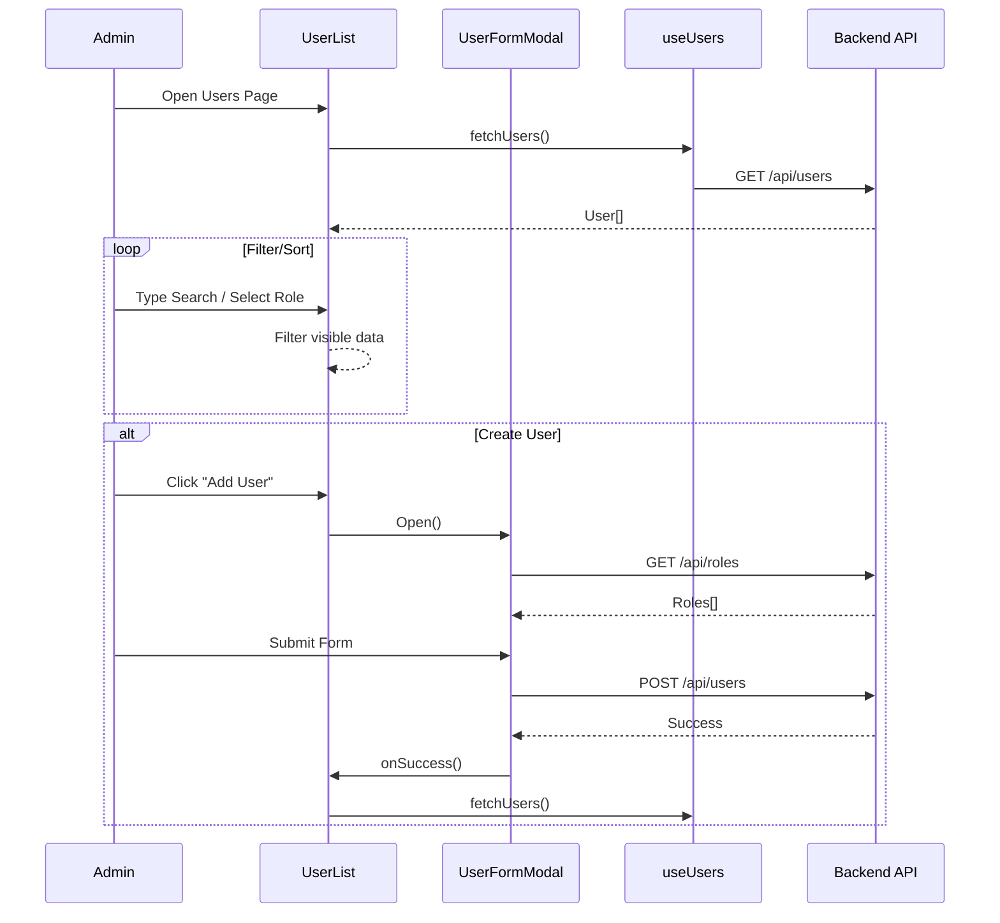

# Users Module Documentation

## Overview
The Users module handles the management of system users (employees). It allows viewing, creating, updating, and deleting users, as well as assigning roles.

## Key Components

### Components
-   **UserList.tsx**: The main view.
    -   Displays users in **Table** or **Grid** view.
    -   Client-side searching (by name/email) and filtering (by role).
    -   Pagination support.
-   **UserFormModal.tsx**: Modal for Adding/Editing users.
    -   Fields: Name, Email, Password (optional on edit), Roles.
    -   Fetches available roles from `/api/roles` on open.

### Hooks
-   **useUsers.ts**: Fetches the list of users from `/api/users`.

## Data Flow

### Viewing Users
1.  `UserList` mounts and calls `useUsers`.
2.  `useUsers` calls `GET /api/users`.
3.  Response JSON contains `User[]`.
4.  `UserList` manages local state for filtering (`q`, `roleFilter`) and pagination.

### Managing Users
-   **Add User**:
    -   Open `UserFormModal`.
    -   Fetch roles (`GET /api/roles`).
    -   Submit `POST /api/users` with `{ name, email, password, roleIds }`.
-   **Edit User**:
    -   Open `UserFormModal` with `initialData`.
    -   Submit `PUT /api/users/:id`.
-   **Delete User**:
    -   Confirm dialog.
    -   Call `DELETE /api/users/:id`.

## Mermaid Flowchart

