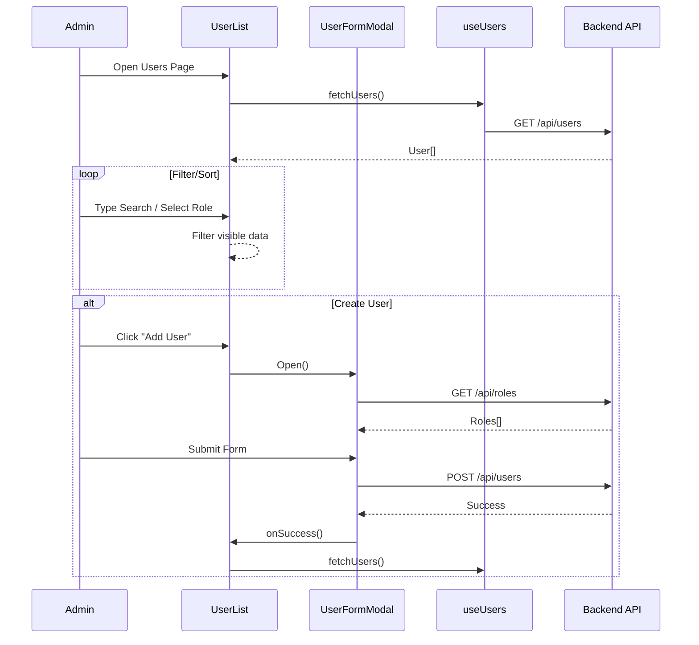

# Users Module Documentation

## Overview
Modul Users menangani management system Users (karyawan). Modul ini memungkinkan viewing, creating, updating, dan deleting Users, serta assigning Roles.

## Key Components

### Components
-   **UserList.tsx**: View utama.
    -   Menampilkan Users dalam mode **Table** atau **Grid**.
    -   Client-side searching (by name/email) dan filtering (by role).
    -   Pagination support.
-   **UserFormModal.tsx**: Modal untuk Adding/Editing Users.
    -   Fields: Name, Email, Password (optional saat edit), Roles.
    -   Fetch roles yang tersedia dari `/api/roles` saat open.

### Hooks
-   **useUsers.ts**: Fetch list Users dari `/api/users`.

## Data Flow

### Viewing Users
1.  `UserList` mounts dan memanggil `useUsers`.
2.  `useUsers` memanggil `GET /api/users`.
3.  Response JSON berisi `User[]`.
4.  `UserList` mengelola local State untuk filtering (`q`, `roleFilter`) dan pagination.

### Managing Users
-   **Add User**:
    -   Open `UserFormModal`.
    -   Fetch roles (`GET /api/roles`).
    -   Submit `POST /api/users` dengan `{ name, email, password, roleIds }`.
-   **Edit User**:
    -   Open `UserFormModal` dengan `initialData`.
    -   Submit `PUT /api/users/:id`.
-   **Delete User**:
    -   Confirm dialog.
    -   Call `DELETE /api/users/:id`.

## Mermaid Flowchart

