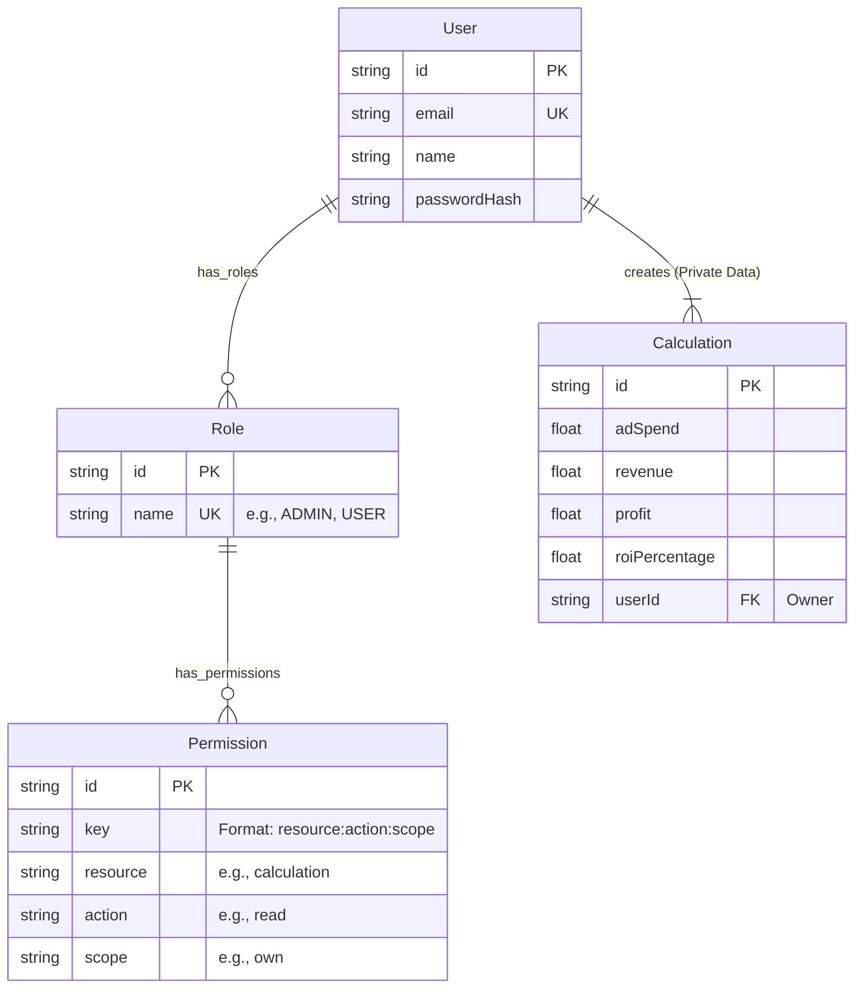

# Presentasi Proyek: ROI Calculator & Access Management System

File ini berisi ringkasan teknis dan alur pengerjaan proyek untuk kebutuhan presentasi.

## 1. Alur Pengerjaan (Development Workflow)

Pengembangan aplikasi ini dilakukan melalui tahapan sistematis berikut:

1.  **Analisis Kebutuhan & Desain**
    *   Mengidentifikasi kebutuhan inti: Kalkulasi ROI yang privat dan sistem Role-Based Access Control (RBAC).
    *   Merancang ERD (Entity Relationship Diagram) untuk mencakup User, Role, Permission, dan Calculation.
    *   Memilih Tech Stack yang optimal untuk performa dan skalabilitas (Next.js App Router).

2.  **Setup Environment & Database**
    *   Inisialisasi project Next.js dengan TypeScript.
    *   Setup database PostgreSQL (via Supabase) dan konfigurasi TypeORM.
    *   Implementasi Script Otomatisasi (DB Migrations & Seeding) di `src/server/db`.

3.  **Implementasi Backend & Architecture**
    *   Membangun **Layer Service** untuk enkapsulasi logika bisnis (`src/server/services`).
    *   Membangun **CRUD Factory** untuk efisiensi kode (DRY Principle).
    *   Implementasi sistem **RBAC** (Permission Checks) menggunakan session storage.

4.  **Implementasi Modul Fitur (Frontend)**
    *   **Auth Module**: Login/Register dengan Session Management (`src/modules/auth`).
    *   **Calculate Module**: Logika kalkulator ROI dan integrasi AI (`src/modules/calculate`).
    *   **Dashboard & User Management**: UI untuk Admin mengelola User dan Role.

5.  **Integrasi AI & Penyempurnaan**
    *   Integrasi Google Gemini API untuk analisis data kampanye.
    *   Implementasi i18n (Internationalization) untuk Bahasa Indonesia dan Inggris.
    *   Refactoring kode dan optimasi performa.

---

## 2. Tech Stack

Solusi ini dibangun di atas teknologi modern yang menekankan pada Type Safety, Performa, dan Kecepatan Pengembangan.

| Kategori | Teknologi | Alasan Pemilihan |
| :--- | :--- | :--- |
| **Framework** | **Next.js 16 (App Router)** | Performa server-side rendering (SSR), struktur routing modern, dan ekosistem React 19. |
| **Language** | **TypeScript** | Type safety ketat untuk mencegah bug saat runtime. |
| **Database** | **Supabase (PostgreSQL)** | Database relasional yang kuat dengan skala cloud. Menggunakan Pooler (port 6543) untuk koneksi serverless. |
| **ORM** | **TypeORM** | Manajemen skema database berbasis Class dan Migrations yang terstruktur. |
| **Auth** | **NextAuth.js + JWT** | Solusi autentikasi standar industri yang aman dan fleksibel. |
| **Styling** | **Ant Design + Tailwind** | Kombinasi komponen UI siap pakai (Antd) dan utilitas styling cepat (Tailwind). |
| **Validation** | **Zod** | Validasi skema data runtime untuk API dan Form. |
| **AI** | **Google Gemini 2.0 Flash** | Model Generative AI yang cepat dan cost-effective untuk analisis data. |

---

## 3. Diagram Arsitektur

### Entity Relationship Diagram (ERD)

Sistem database dirancang untuk mendukung RBAC dan kepemilikan data privat.

### Alur Autentikasi & RBAC

1.  **Login**: User mengirim kredensial -> Server memverifikasi hash password.
2.  **Session Hydration**: Server mengambil semua Role User -> Mengumpulkan semua Permission -> Menyimpan Permission Keys ke dalam Session Token.
3.  **Access Guard**: Setiap request ke route/API dicek menggunakan middleware `checkPermission(resource, action, scope)`.

---

## 4. Penjelasan Logika Utama

### A. Logika Kalkulasi ROI
Kalkulator ini memberikan *feedback* instan kepada user dengan rumus bisnis berikut:

1.  **Results (Jumlah Konversi)**: `Floor(Ad Spend / Cost Per Result)`
    *   Menghitung estimasi jumlah penjualan yang bisa didapat dari budget iklan.
2.  **Revenue (Omzet)**: `Results * Average Order Value (AOV)`
    *   Estimasi total pendapatan kotor.
3.  **Profit (Laba Bersih)**: `Revenue - Ad Spend`
    *   Keuntungan murni setelah dikurangi biaya iklan (Gross Profit).
4.  **ROI (Return On Investment)**: `(Profit / Ad Spend) * 100`
    *   Metrik efisiensi utama. ROI > 0% berarti untung, ROI < 0% berarti rugi.

### B. Mekanisme AI Analysis
Fitur "Analyze with AI" menggunakan pendekatan *Prompt Engineering* terstruktur:

1.  **Input**: Data kalkulasi (Spend, ROI, Profit) dikirim ke backend.
2.  **Processing**: Backend menyuntikkan data tersebut ke dalam *System Prompt* yang bertindak sebagai "Expert Digital Marketer".
    *   *Skenario 1 (Rugi)*: AI diminta memberikan solusi fixing (e.g., turunkan CPR, naikkan AOV).
    *   *Skenario 2 (Untung)*: AI diminta memberikan strategi scaling (e.g., tambah budget).
3.  **Output**: AI mengembalikan respons JSON berisi `health_score`, `risk_level`, dan `action_plan` yang ditampilkan di UI.

### C. Sistem CRUD Factory
Untuk menghindari duplikasi kode (DRY), operasi database standar diabstraksi menggunakan `CurdFactory`:
*   Daripada menulis ulang fungsi `create`, `findAll`, `findOne` untuk setiap entitas, kita membuat instance factory:
    *   `export const UserService = new CurdFactory(UserEntity);`
*   Ini mempercepat pengembangan fitur baru secara signifikan.
