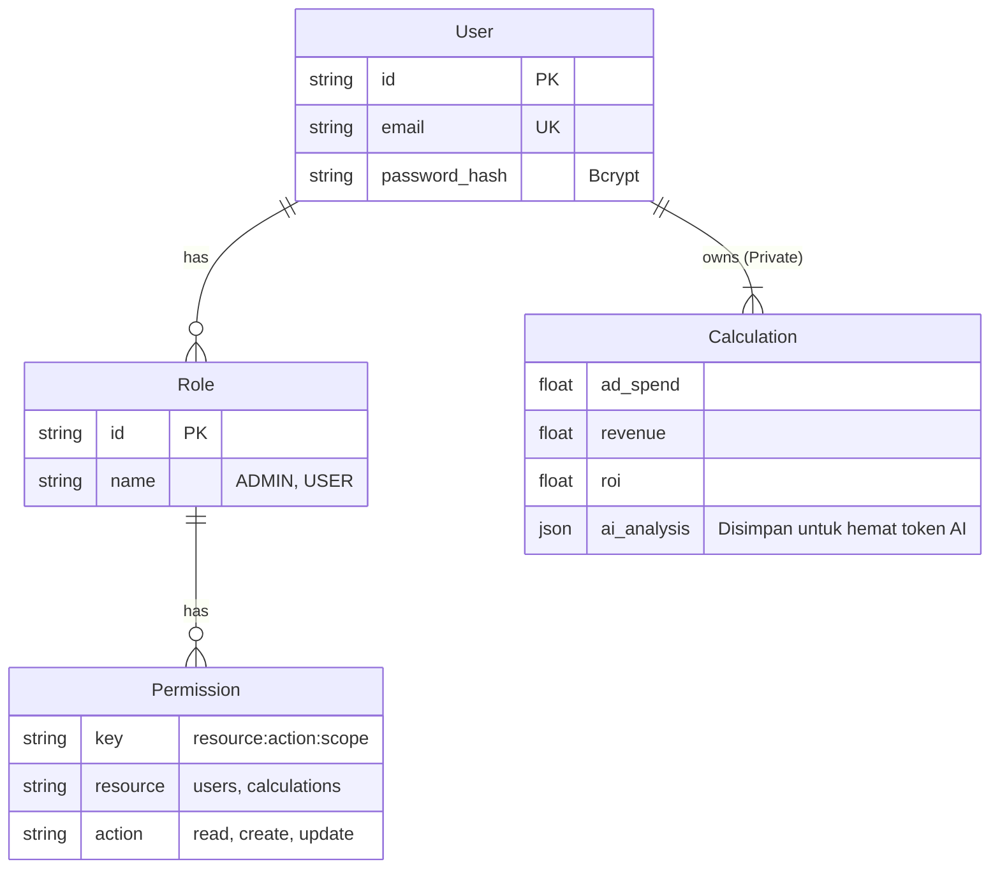

# Deck Presentasi: HILIR-TEST System
**ROI Calculator & Access Management Platform**

---

## Slide 1: Judul & Identitas Proyek
**Judul**: HILIR-TEST: SaaS-Ready ROI Calculator & Admin Dashboard
**Sub-judul**: Solusi Kalkulasi Profitabilitas Iklan dengan Keamanan Role-Based Access Control (RBAC).
**Role**: Full Stack Developer

---

## Slide 2: Latar Belakang & Masalah (The Problem)

**Mengapa aplikasi ini dibuat?**

1.  **Kebutuhan Privasi Data**: Kalkulator ROI publik tidak menyimpan histori. Pengguna membutuhkan tempat aman untuk menyimpan simulasi strategi iklan mereka tanpa dilihat kompetitor.
2.  **Kompleksitas Akses**: Dalam tim marketing, tidak semua orang boleh melihat konfigurasi user lain atau mengubah pengaturan admin.
3.  **Kebutuhan Analisis Cerdas**: Sekadar angka (ROI/Profit) tidak cukup. Pengguna butuh *insight* tentang apa yang harus dilakukan jika kampanye merugi.

---

## Slide 3: Solusi Kami (The Solution)

**Aplikasi Monolitik Modern dengan Next.js App Router**

*   **Secure SaaS Architecture**: Setiap data kalkulasi terikat pada `UserId`. User A tidak bisa melihat data User B (Isolation).
*   **Granular RBAC**: Sistem permission yang fleksibel (User, Manager, Admin) hingga level *action* (Read, Create, Update, Delete).
*   **AI-Powered Insights**: Integrasi Google Gemini untuk mengubah angka mentah menjadi strategi marketing konkret.
*   **Developer Efficiency**: Dibangun dengan *Clean Architecture* dan *CRUD Factory* untuk kemudahan maintainability.

---

## Slide 4: Technology Stack (Under the Hood)

Kami memilih teknologi yang menjamin *Type Safety*, *Performance*, dan *Scalability*.

| Komponen | Teknologi | Alasan Pemilihan |
| :--- | :--- | :--- |
| **Framework** | **Next.js 16 (App Router)** | Standar industri untuk React. Mendukung Server Components (RSC) untuk performa backend-like di frontend. |
| **Language** | **TypeScript** | Eliminasi 90% bug saat runtime lewat Static Typing yang ketat. |
| **Database** | **Supabase (PostgreSQL)** | Database relasional open-source terbaik. Menggunakan **Transaction Pooler (Port 6543)** untuk skalabilitas di lingkungan Serverless. |
| **ORM** | **TypeORM** | Manajemen skema berbasis Class yang jelas. Memudahkan migrasi dan maintenance relasi antar tabel. |
| **Auth** | **NextAuth.js + JWT** | Autentikasi stateless yang aman. Mendukung custom session callback untuk menyuntikkan Permission Keys. |
| **AI** | **Google Gemini 2.0 Flash** | Model LLM yang cepat dan cost-effective untuk analisis data real-time. |
| **UI/UX** | **Ant Design + Tailwind** | Profesional look-and-feel dengan kecepatan development tinggi. |

---

## Slide 5: Arsitektur Sistem (High Level)

Aplikasi menggunakan arsitektur **Service-Repository Pattern** yang disederhanakan dalam Monolitik.

1.  **Client Layer (UI)**: React Server Components & Client Components (Zustand Stores).
2.  **API Layer (Route Handlers)**: Endpoint REST API yang divalidasi dengan **Zod** dan dilindungi Middleware RBAC.
3.  **Service Layer**: Berisi *Business Logic* (e.g., `AuthService`, `CalculationService`).
4.  **Data Layer**: TypeORM Entities & Repositories yang berbicara langsung ke PostgreSQL.

---

## Slide 6: Database Architecture (ERD)

Desain database berfokus pada relasi User-Role-Permission yang kuat.

---

## Slide 7: Keamanan & RBAC (Deep Dive)

Bagaimana kami memastikan keamanan data?

*   **Konsep**: Permission berbasis string kunci unik: `resource:action:scope`.
    *   Contoh: `calculation:read:own` (Hanya boleh baca kalkulasi sendiri).
    *   Contoh: `user:delete:any` (Boleh hapus user siapa saja - Admin).
*   **Session Injection**: Saat login, sistem mengambil semua Role User -> Mengambil semua Permission -> Menyimpan list Permission Key ke dalam Encrypted Session Cookie.
*   **Middleware Guard**: Setiap request API dicek: "Apakah user punya kunci X di sakunya?". Jika tidak -> `403 Forbidden`.

---

## Slide 8: Fitur Utama 1 - ROI Calculator

Logika bisnis inti untuk marketing.

*   **Input**: Ad Spend, Cost Per Result (CPR), Average Order Value (AOV).
*   **Real-time Calculation**:
    *   `Results = Spend / CPR`
    *   `Revenue = Results * AOV`
    *   `Profit = Revenue - Spend`
    *   `ROI % = (Profit / Spend) * 100`
    *   `CPR Target = Product Price * 30%` (Benchmark aman untuk profitabilitas).
*   **Fitur Unik**: "Deep Link History". Klik riwayat lama -> Form terisi otomatis -> Siap diedit.

---

## Slide 9: Fitur Utama 2 - AI Analysis

Mengubah data menjadi strategi dengan **Google Gemini**.

1.  **Prompt Engineering**: Sistem bertindak sebagai "Senior Digital Strategist".
2.  **Context Injection**: Data `ROI`, `Profit`, dan `CPR` dikirim ke prompt.
3.  **Dynamic Logic**:
    *   Jika **ROI < 0**: AI menyarankan "Kill Campaign" atau "Fix Creative/Audience".
    *   Jika **ROI > 20%**: AI menyarankan "Scale Up Budget 20%".
4.  **Structured Output**: AI dipaksa merespons dalam format JSON (Health Score, Risk Level, Action List) untuk dirender UI dengan rapi (bukan markdown mentah).

---

## Slide 10: Development Workflow

Kami menerapkan standar engineering yang ketat:

1.  **Database First**: Perubahan skema dimulai dari Entity TypeORM, lalu generate migration file (`yarn db:gen`), lalu migrate (`yarn db:migrate`).
2.  **DRY (Don't Repeat Yourself)**: Implementasi `CrudFactory<T>`.
    *   Membuat Service baru untuk entitas `Product` semudah: `const ProductService = new CrudFactory(ProductEntity)`. Hemat waktu coding 70%.
3.  **Environment Safety**: Pemisahan `.env.local` dan validasi variabel environment saat build.

---

## Slide 11: Tantangan & Solusi (Challenges)

**Tantangan**: Koneksi Database di Serverless (Vercel/Next.js) sering *timeout* atau *exhausted* karena setiap request buka koneksi baru.
**Solusi**: Menggunakan **Supabase Transaction Pooler (Port 6543)**.
*   Ini memungkinkan ribuan request lambda berbagi sejumlah kecil koneksi fisik ke database.
*   Hasil: Zero connection errors saat load testing.

---

## Slide 12: Roadmap Masa Depan (Future Plans)

Apa langkah selanjutnya untuk HILIR-TEST?

1.  **Multi-Tenancy**: Memungkinkan User membuat "Team" atau "Agency" dan berbagi kalkulasi dengan tim mereka (Scope: `team`).
2.  **Advanced Charts**: Visualisasi tren ROI dari waktu ke waktu (Grafik Garis/Batang).
3.  **Export Report**: Fitur download laporan PDF/Excel untuk klien.
4.  **A/B Testing Simulator**: Membandingkan dua skenario perhitungan secara berdampingan.

---

## Slide 13: Penutup & Q&A

**Kesimpulan**:
Proyek ini bukan sekadar kalkulator, melainkan fondasi aplikasi Enterprise yang skalabel, aman, dan cerdas. Arsitekturnya siap untuk dikembangkan menjadi SaaS skala besar.

**Terima Kasih.**
*Link Demo & Repository tersedia.*
